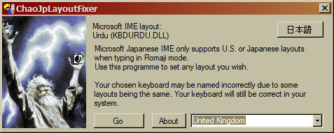

# ChaoJpLayoutFixer

If you're using Microsoft Japanese IME, the only layouts available in direct input mode (Romaji) are the standard Japanese and U.S. keyboards.

This value is controlled by a registry key; this software lists all the layouts available on your machine, and you can choose which one to use for direct input mode. 
This may be particularly useful if you have a non-U.S. or Japanese keyboard, and want to type in both languages with only the Japanese IME.

As some layouts use the same DLL, they might be displayed with the wrong name. This does not make any difference and is only a limitation of this program. A future release will fix this, although it does not affect functionality.

A backup of your Japanese input method is made to a .reg file such that you can undo changes without using the software.

A very small percentage of antivirus software might flag this as a trojan due to registry modification. Please feel free to browse the source code and build the solution for yourself.

The application will check for updates from the GitHub release page on launch and notify you if one is available

# ChaoJpLayoutFixer （日本語版）

説明は現在未翻訳です。プログラムは日本語で使用することができます。
